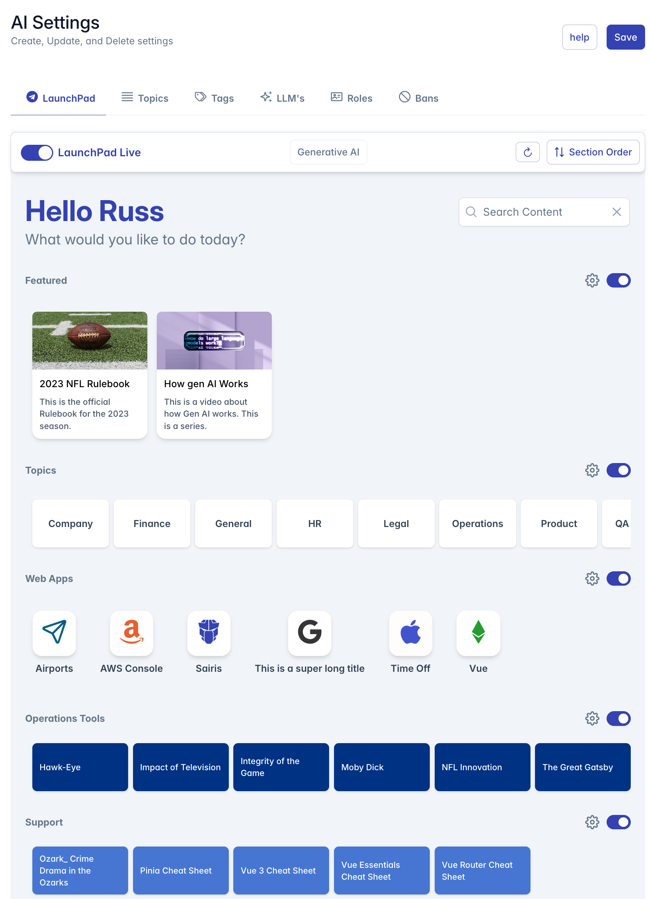

# LaunchPad User Guide

<!--
## Table of Contents
- [LaunchPad User Guide](#launchpad-user-guide)
  - [Table of Contents](#table-of-contents)
  - [Introduction](#introduction)
  - [Getting Started](#getting-started)
  - [LaunchPad Interface Overview](#launchpad-interface-overview)
  - [Managing Sections](#managing-sections)
    - [Section Types](#section-types)
    - [Adding Sections](#adding-sections)
    - [Configuring Sections](#configuring-sections)
    - [Reordering Sections](#reordering-sections)
  - [Content Cards](#content-cards)
  - [Search Functionality](#search-functionality)
  - [Customization Options](#customization-options)
    - [Section Visibility](#section-visibility)
    - [Card Appearance](#card-appearance)
  - [Troubleshooting](#troubleshooting)
-->

## Introduction

LaunchPad is a customizable home screen for the AI Assistant that provides quick access to your most frequently used content. This guide will walk you through all the features and functionality to help you create an optimal end-user experience.

## Getting Started

When you first access the LaunchPad, you'll see a greeting with your name and the question "What would you like to do today?" along with any configured content sections.

The LaunchPad allows you to:
- Create and customize multiple content sections
- Filter content by type, topic, or tags
- Search across all available content
- Reorder sections to prioritize important information
- Enable or disable individual sections

## LaunchPad Interface Overview

The LaunchPad consists of several key components:

1. **Header Area**: Contains your personalized greeting and global search bar
2. **Toggle Control**: Enables or disables the entire LaunchPad functionality
3. **Section Rows**: Customizable content containers that display filtered content
4. **Content Cards**: Individual items that appear in each section
5. **Admin Controls**: Section configuration and ordering tools (visible to users with appropriate permissions)

## Managing Sections

### Section Types

LaunchPad supports three types of sections:

1. **Featured** (Protected): Displays content marked as "featured" with images and descriptions
2. **DynamicTopic** (Protected): Automatically categorizes content based on its assigned topics
3. **Topic**: User-defined sections with custom filtering options

### Adding Sections

To add a new section:

1. Click the "Add Section" button located at the bottom right of the screen
2. Configure the section settings in the dialog that appears
3. Click "Done" to save your changes

### Configuring Sections

Each section can be customized with the following settings:

1. **Section Name**: The title displayed above the section
2. **Match By Content Type**: Filter content by type (Blueprint, Document, Link, Knowledgebase)
3. **Match By Topic**: Filter content to display only items with a specific topic
4. **Match By Tags**: Filter content to display only items with specific tags
5. **Section Appearance**: Customize background and text colors for both light and dark modes

To configure an existing section:

1. Find the gear icon next to the section title
2. Click the icon to open the configuration dialog
3. Adjust settings as needed
4. Click "Done" to save changes

For DynamicTopic sections, you can also choose between "By Row" or "By Column" display formats.

### Reordering Sections

To change the order of sections:

1. Click the "Section Order" button in the top menu bar
2. In the dialog that appears, drag and drop sections using the handle (⋮⋮) on the left
3. The order of sections will update automatically
4. Close the dialog when finished

## Content Cards

Content cards in LaunchPad display different types of content:

1. **Blueprint Cards**: Display blueprint names or conversation starters
   - Regular blueprints appear as standard cards
   - Blueprints with conversation starters show each starter as a separate card

2. **Document Cards**: Show document titles in cards with customizable background and text colors

3. **Web Link Cards**: Display an icon and link title in a specialized format with:
   - Custom icon
   - Icon background and border colors
   - Link name displayed below the icon

Cards appear in a horizontal scrolling row within their assigned section. Users can click on a card to access the associated content.

## Search Functionality

The global search bar allows users to filter all content across all sections:

1. Enter search text in the search field at the top right
2. Results will filter in real-time as you type
3. Content matching the search term (by name or tag) will be displayed
4. Empty sections are automatically hidden

## Customization Options

### Section Visibility

Each section can be individually enabled or disabled:

1. Use the toggle switch next to the section title
2. Disabled sections will display a message indicating they are currently disabled

### Card Appearance

Section cards can be customized with different colors:

1. Background color (light mode)
2. Text color (light mode)
3. Background color (dark mode)
4. Text color (dark mode)

Preview your customizations in real-time within the section configuration dialog using the light/dark mode toggle.

## Troubleshooting

**Issue**: Content not appearing in a section
- Verify the content matches the section's filtering criteria (content type, topic, tags)
- Ensure the content's publish dates are valid
- Check that the section is enabled

**Issue**: Unable to delete a section
- Featured and DynamicTopic sections are protected and cannot be deleted
- These sections can be disabled instead

**Issue**: Section appears empty
- If no content matches the section's filtering criteria, the section will be hidden
- Adjust the filtering criteria or add matching content

**Issue**: Changes not saving
- Ensure you have appropriate permissions (Admin, Content, or Manager roles)
- Click "Done" after making changes to save them

---

For additional assistance, contact your system administrator or refer to the advanced configuration documentation.